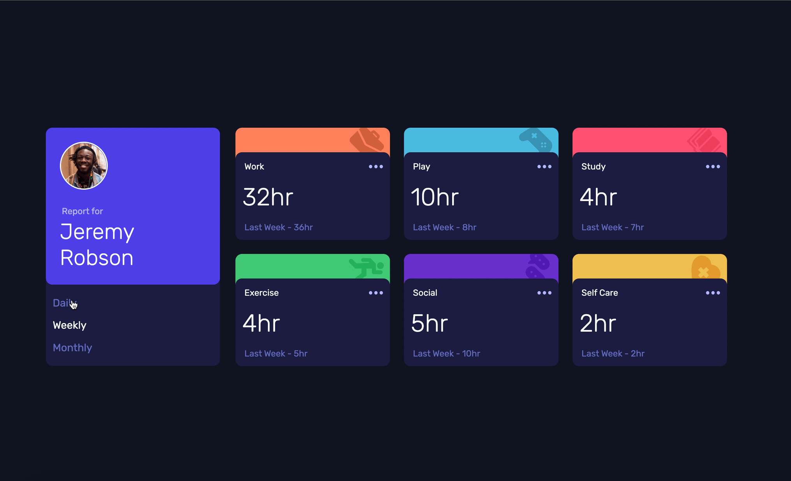
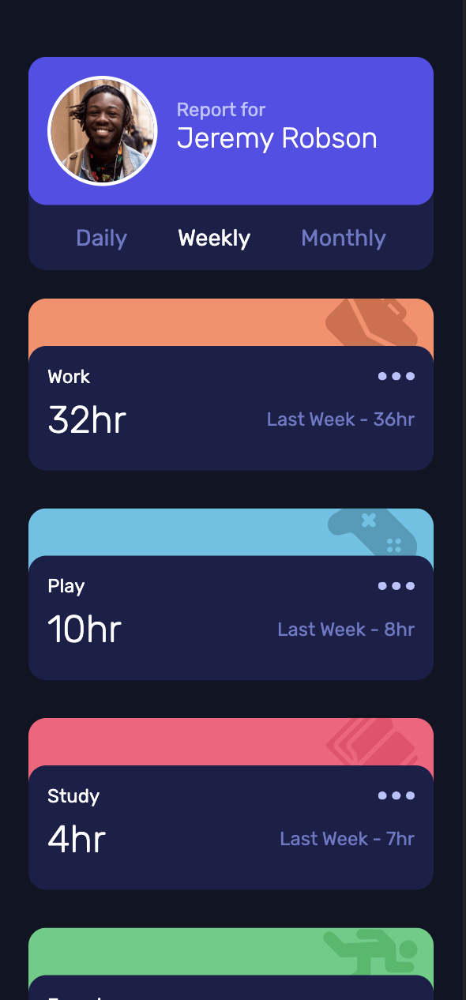

# Intro section with dropdown navigation solution

This is a solution to the [Intro section with dropdown navigation challenge on Frontend Mentor](https://www.frontendmentor.io/challenges/intro-section-with-dropdown-navigation-ryaPetHE5).

## Overview

### The challenge

Your users should be able to:

- View the optimal layout for the site depending on their device's screen size.
- See hover states for all interactive elements on the page.
- Switch between viewing Daily, Weekly, and Monthly stats.

### Screenshot

### Links

- Live Site [URL](https://yuliia-p.github.io/Time-tracking-dashboard/)

## My process

### Built with

- Semantic HTML5 markup
- CSS custom properties
- Flexbox
- Mobile-first workflow
- JS

## Author

- LinkedIn - [Yuliia Pchelintseva](https://https://www.linkedin.com/in/yuliia-pch/)
